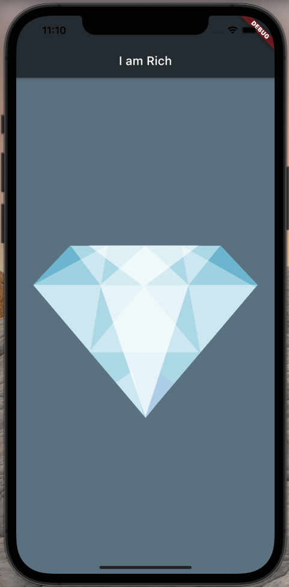

# I am Rich - Vivyan's Version 

## Goal
My version of I am Rich app. A good exercise to how to build an Flutter app. It was one of my firsts Flutter apps.

## The App
It's one screen app with a diamond image.

## Features
- Implemented App icons for Android and iOS;
- Material Design based;
- Simple design, only one static image.
